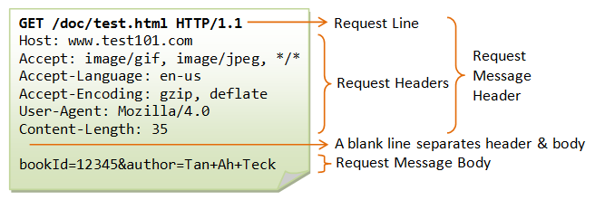
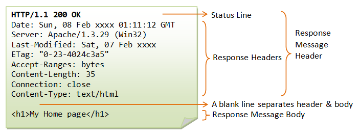

# 2025-11-23
Jag har senaste tiden gått genom några olika rum, men det har blivit lite här och lite där så jag skrev inte upp så mycket på vägen. Så jag tänkte gå genom mina framsteg nu i efterhand istället.  
Det har varit web hacking i fokus senaste tiden och såhär ser det ut just nu:

---
 

Vi går i kronologisk ordning så vi börjar med the basics.  
Inte så mycket nytt för mig här, vi går genom HTML, CSS och JS. Rummet pratar om Databases, Infrastructure och WAF. Med Infrastructure så syftas det på servrar, applikationsservrar, storage osv. WAF betyder Web Application Firewall.

Intressanta delar här för mig var:  
HTTP Messages, dvs HTTP Request och HTTP Response. Saker jag än inte riktigt förstår men som de försöker förklara är hur dessa är uppbyggda och används i HTTP-trafik. Jag hittade nedanstående bilder på nätet som hjälper litegrann:  
 
 

Mer intressant är väl de vanliga status-koderna som t.ex.:  
200 - Success  
300 - Redirect  
400 - Client Error (not found)  
500 - Server Error  

---
 

  

Rummet börjar med att gå genom lite grundläggande programmering och förklarar vad en variabel, funktioner och loopar är. Vi får sedan prova på att koda i javascript i en webbläsares konsoll. Det var lite kul!  
Sedan får man se hur man kan integrera javascript-kod i html, antingen internal eller external. Och till slut så går vi genom minified files. Vilket var ett nytt koncept för mig. Det här kommer nog komma till användning i CTF-sammanhang i framtiden.
 

---
 

  
Jag har gått en kurs om databaser så jag var ganska bekant med det mesta i det här rummet. Specifikt språket i SQL är jag ganska bekant med, det tog inte så länge innan jag kom in i det igen.  

---
 

Jag glömde ta en screnshot av BURP Suite Basics, och det var nog lika bra. För jag har använt mig lite av BURP Suite i CTF-sammanhang och jag känner mig fortfarande ganska vilse. Med andra ord bör jag nog starta om det här rummet och köra genom det med mer uppmärksamhet, så det är min plan. Jag kommer eventuellt även starta om OWASP Top 10 2021 då jag tyckte flera aspekter där var väldigt intressanta men man fick en kortare genomgång vilket gör att det kan repeteras känner jag.

# 2025-11-09
https://tryhackme.com/room/meterpreter  
Sådär. Då blev jag klar med Metasploit. Riktigt roliga rum. Jag har i vanlig ordning missförstått och läst fel på ett par ställen så man fick slita sig i håret något och testa sig fram med olika grejer innan jag insett att jag gjort fel och att då var svaret relativt enkelt. Men jag tror det bara har gett mig lite mer erfarenhet med att knappa runt inom metasploit framework. Mot slutet kändes det riktigt naturligt att söka fram en modul och ladda den med nödvändiga options-alternativ.  

  
https://tryhackme.com/room/blue  
Nu ska jag attackera rummet Blue och bara av att öppna det så ser det riktigt spännande ut.  
Det var det också. Jag blev just klar, riktigt kul att få gå genom hela processen från början till slutet. Ganska enkelt att hänga med hela vägen efter alla instruktioner. Jag såg att det rekommenderades att testa "Ice" efteråt. Så det rummet ska nog testas rätt snart också. Men det här får nog räcka för idag.  
  
https://tryhackme.com/room/ice  
Jag kanske tog lite mer tid idag för att fortsätta. Men rummet tog nog bara 30-45 minuter. 
Rummet ICE var lika roligt som rummet Blue. Tydliga och enkla instruktioner, men fick använda mig av några andra knep denna gång. Modulen 'post/multi/recon/local_exploit_suggester' var en jag verkligen gillar då jag tidigare funderat hur man ska hålla reda på alla relevanta exploits man ska använda vid olika typer av maskiner man ska attackera. Det här underlättar ju en hel del. 
Sedan var det kul att testa den nyare versionen av mimikatz, dvs kiwi. Väldigt kraftfullt verktyg. Men rummet antydde att en anledning till varför det är så enkelt är att maskinen i fråga hade avstängd brandvägg och inte igång Windows defender. En mer modern maskin är nog inte lika enkel. 

# 2025-11-08
https://tryhackme.com/room/metasploitexploitation  
Verkar som jag försöker köra minst en varje dag nu, får se om det håller i sig.

# 2025-11-07
https://tryhackme.com/room/metasploitintro  
Körde vidare lite lätt idag.

# 2025-11-06
Testar att starta en liten dagbok för detta.  
 
De har just pensionerat gamla SOC Level 1, tur jag inte hann klart den.  
  
Dags att ta tag i exploitation basics!